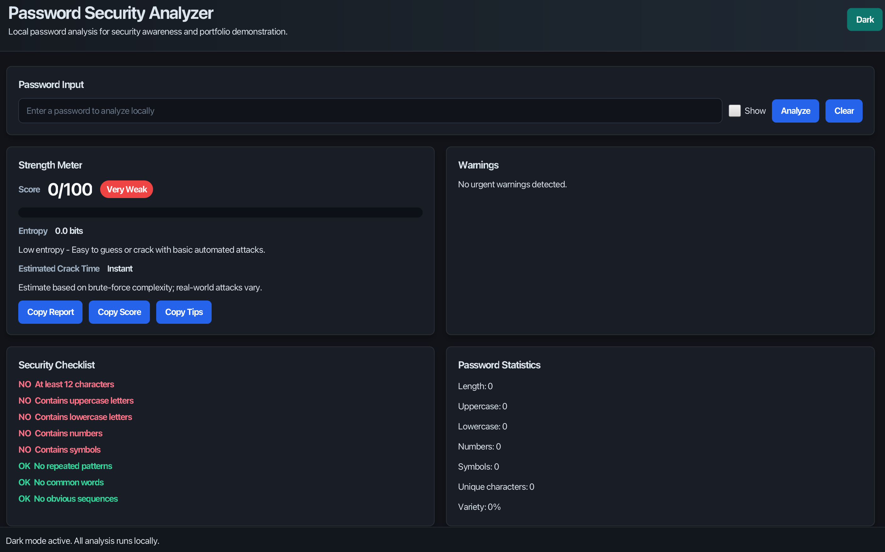
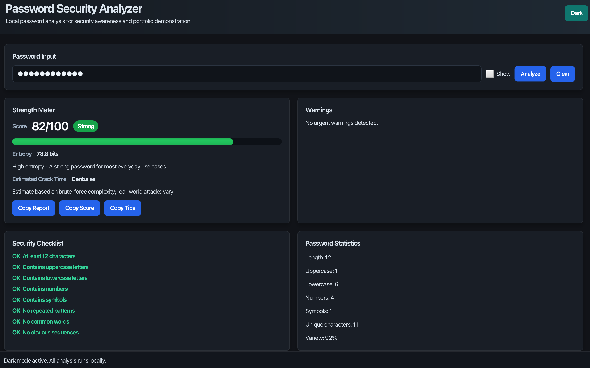
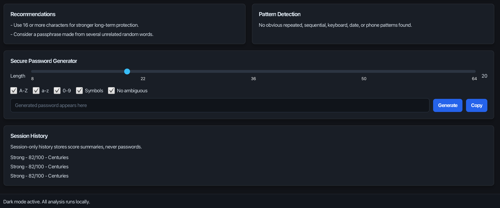
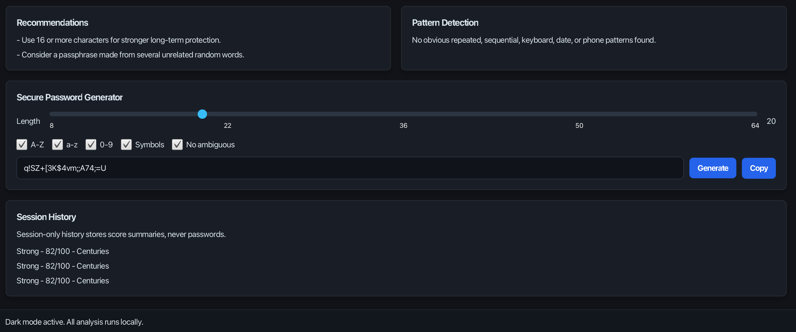

# Password Security Analyzer

A modern JavaFX desktop application that analyzes password strength locally and provides practical security feedback. The project is designed for cybersecurity portfolio use and follows a simple MVC structure with separate model, service, controller, utility, and view layers.

## Features

- Password input with show/hide, analyze, and clear controls
- Real-time local analysis while typing
- Animated strength meter with Very Weak, Weak, Fair, Strong, and Very Strong levels
- Score out of 100 based on length, character types, entropy, diversity, and penalties
- Security checklist for length, uppercase, lowercase, numbers, symbols, repeated patterns, common words, and obvious sequences
- Statistics panel with length, character counts, unique characters, estimated entropy, and variety percentage
- Brute-force time estimate with an explanation that results are approximate
- Built-in common-password detection with several hundred entries
- Pattern detection for repeated characters, repeated chunks, keyboard walks, sequential letters/numbers, dates, and phone-like values
- Personalized improvement suggestions
- Secure password generator using `SecureRandom`
- Length slider from 8 to 64 characters
- Generator options for uppercase, lowercase, numbers, symbols, and ambiguous-character exclusion
- Dark and light mode for the current session
- Copy report, score, and recommendations without copying the analyzed password
- Session-only analysis history that stores score summaries, never passwords
- Tooltips and accessibility labels for important controls

## Technologies Used

- Java 21+
- JavaFX
- Maven
- JUnit 5
- IntelliJ IDEA Community Edition

## Screenshots

### Main Dashboard



### Strong Password Analysis



### Password Generator



### Generated Password



## Installation

1. Install JDK 21 or later.
2. Install Maven 3.9 or later.
3. Open the `PasswordSecurityAnalyzer` folder in IntelliJ IDEA Community Edition.
4. Let IntelliJ import the Maven project and download dependencies.

## GitHub Upload

To upload this project to a new GitHub repository:

```bash
git init
git add .
git commit -m "Initial password security analyzer"
git branch -M main
git remote add origin https://github.com/YOUR-USERNAME/password-security-analyzer.git
git push -u origin main
```

Replace `YOUR-USERNAME` with your GitHub username and use the repository URL GitHub gives you.

## Running the Application

From the project root:

```bash
mvn clean javafx:run
```

Or in IntelliJ:

1. Open the Maven tool window.
2. Run `clean`.
3. Run `javafx:run`.

## Running Tests

```bash
mvn test
```

## Folder Structure

```text
PasswordSecurityAnalyzer/
├── src/main/java/
│   ├── controller/
│   │   └── MainController.java
│   ├── model/
│   ├── service/
│   ├── util/
│   ├── view/
│   │   └── MainView.java
│   └── Main.java
├── src/main/resources/
│   └── css/
│       └── styles.css
├── src/test/java/
│   └── service/
├── docs/
│   └── screenshots/
├── pom.xml
└── README.md
```

## Security Considerations

- Password analysis is completely local.
- The application does not transmit passwords over the network.
- The application does not save analyzed passwords to disk.
- The application does not print passwords to the console.
- Copied reports intentionally exclude the password itself.
- Session history stores only score summaries and is cleared when the app closes.
- Generated passwords use Java's `SecureRandom`.

## Future Improvements

- Export report as PDF while still excluding the password
- Add localization support
- Add optional custom wordlists loaded for the current session only
- Add zxcvbn-style ranked pattern analysis
- Add more automated UI tests
- Package native installers for macOS, Windows, and Linux

## License

MIT License. Use this project for learning, portfolio demonstrations, and security-awareness education.
